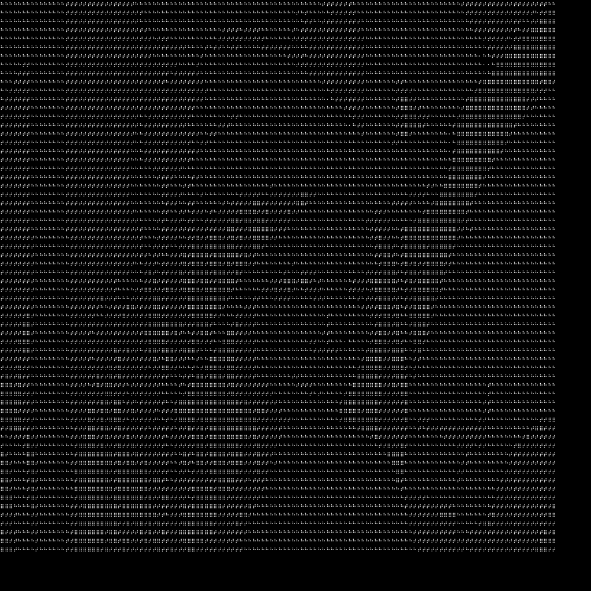

# dots image generator

画像ファイルから点字で描かれた画像を出力する。

## Installation

```bash
git clone https://github.com/SakuraWine/dots_image_generator.git
cd dots_image_generator
pip install -r requirements.txt
```

## Usage

1. 使用する画像を`data`ディレクトリ内へ入れる。
1. `convert.py`を実行する。（コマンドは下記参照）
1. `output`ディレクトリ内に点字風画像が出力される。

```bash
python ./src/converter.py -s <source_filename> -l <level>
```

## Args

- -s [--source-image] 元画像のファイル名。
- -l [--level] 難易度。1から5の1刻みで、大きいほど低い解像度の画像が出力される。


## Example

```bash
python ./src/converter.py -s sample.png -l 3
```


